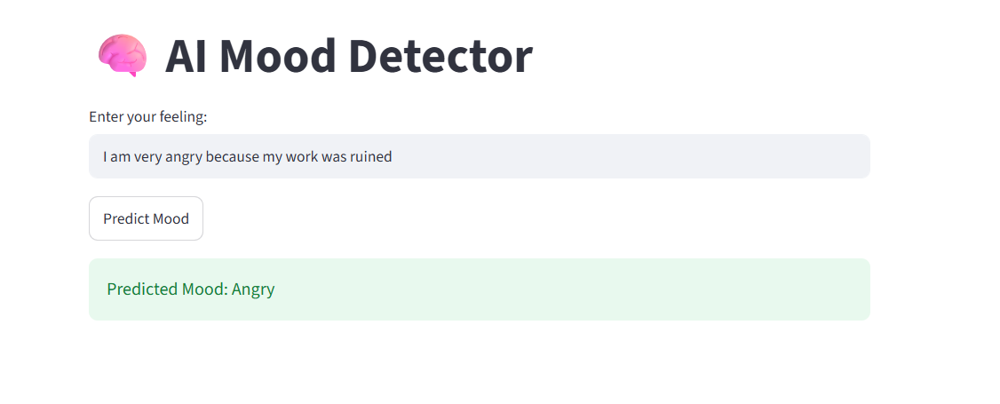

# AI Mood Detector

## Overview
AI Mood Detector is a machine learning project that predicts a user's mood based on text input.

## Features
- Predicts mood from text
- Machine Learning based
- Simple Streamlit interface
- Fast predictions

## Technologies Used
- Python
- Streamlit
- Scikit-learn
- Pandas
- Joblib

## Project Files
- app.py
- mood_model.pkl
- mood_pipeline.pkl
- vectorizer.pkl
- mood_dataset.xlsx
- ai mode code.ipynb

## 📸 Screenshots

### Prediction Result

## Author
**Hamsa H V**
